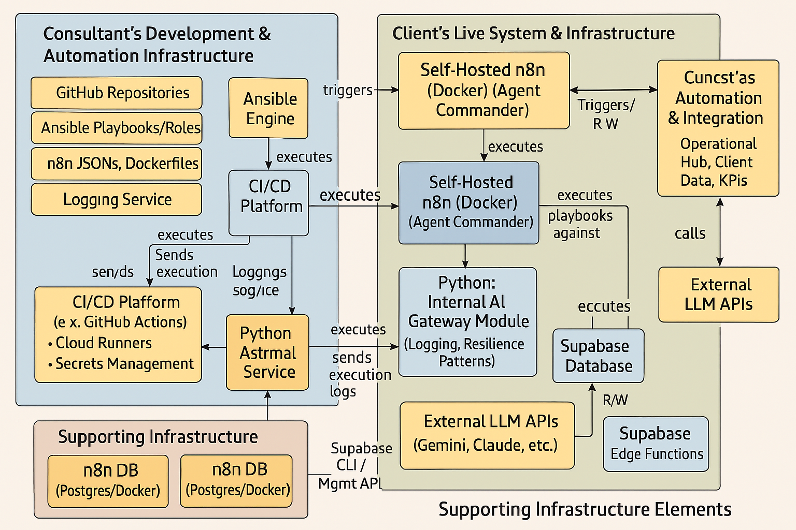

# AI-Enhanced Development & Deployment Factory

> **Strategic Evolution**: Creative Alchemy → AI-Enhanced Development & Deployment Factory

A comprehensive, production-ready infrastructure framework combining Claude MCP integration, Infrastructure as Code (Ansible), advanced logging systems, and real-time monitoring for AI-enhanced development workflows.

## 🎯 **Project Overview**

This repository contains the complete architecture for an AI-Enhanced Development & Deployment Factory that has evolved from the original Creative Alchemy consulting framework. The system provides:

- **Advanced MCP Integration** - Filesystem, Notion, and Docker Model Context Protocol servers
- **Infrastructure as Code** - Ansible-based Notion database management with full lifecycle automation
- **Claude Framework** - Enhanced logging, confidence gates, and uncertainty detection
- **Real-time Monitoring** - Web-based dashboard for system analytics and log visualization
- **Production Verification** - Comprehensive testing framework with 8/8 verification tests passed

## 🏗️ **Architecture Overview**



### **Core Components**

1. **MCP Infrastructure** (`/mcp-config/`)
   - Filesystem server for local document access
   - Notion API integration with 7 production databases
   - Docker containerized services

2. **Claude Framework** (`/claude-framework/`)
   - Structured logging with JSON format
   - Confidence gate integration with uncertainty detection
   - Real-time dashboard for monitoring and analytics
   - Schema validation and error handling

3. **Infrastructure as Code** (`/infrastructure/`)
   - Ansible roles for Notion database management
   - Multi-environment support (dev, staging, prod)
   - Comprehensive deployment and testing playbooks

4. **Verification & Testing** (`/verification/`)
   - NDB verification framework
   - 8 comprehensive test suites
   - Production readiness validation

## 🚀 **Quick Start**

### Prerequisites
- Node.js 16+
- Docker
- Ansible
- Claude Desktop

### Installation

1. **Clone and setup:**
   ```bash
   git clone https://github.com/CreativeAlchemy-consulting/ai-enhanced-factory.git
   cd ai-enhanced-factory
   npm install
   ```

2. **Configure MCP servers:**
   ```bash
   cp mcp-config/claude_desktop_config.json ~/.config/claude-desktop/
   ```

3. **Start the Claude Framework:**
   ```bash
   cd claude-framework
   npm start
   ```

4. **Deploy Notion infrastructure:**
   ```bash
   cd infrastructure
   ansible-playbook playbooks/deploy-notion-infrastructure.yml
   ```

5. **Access the dashboard:**
   ```
   http://localhost:3000
   ```

## 📋 **Component Documentation**

### **MCP Configuration**
- **Filesystem Access**: Desktop, Downloads, Consulting documents
- **Notion Integration**: 7 production databases with full CRUD capabilities
- **Docker Services**: Containerized MCP tools via socat tunnel

### **Claude Framework Features**
- **Confidence Gate**: Uncertainty detection and safety mechanisms
- **Enhanced Logging**: Structured JSON logs with operation tracking
- **Real-time Dashboard**: Web interface for monitoring and analytics
- **Schema Validation**: Flexible data validation with custom rules

### **Infrastructure as Code**
- **Ansible Roles**: Complete Notion database lifecycle management
- **Idempotent Operations**: Search-before-create, force-update controls
- **Multi-Environment**: Development, staging, production configurations
- **Comprehensive Testing**: Automated verification and validation

## 📊 **Production Status**

### **Verification Results**
```yaml
verification_timestamp: "2025-06-07T12:40:10.915864"
framework_version: "1.0.0"
tests_passed: 8
tests_failed: 0
warnings: 0
overall_status: "ALL VERIFICATION TESTS PASSED!"
```

### **Infrastructure Verification**
- ✅ **NDB-IP1.1**: Ansible Infrastructure Structure
- ✅ **NDB-IP1.2**: Database Schema Definitions
- ✅ **NDB-IP1.3**: Property Validation Logic
- ✅ **NDB-IP1.4**: Idempotent Operations
- ✅ **NDB-IP1.5**: Error Handling Coverage
- ✅ **NDB-IP1.6**: Workspace Parameterization
- ✅ **NDB-IP1.7**: Deployment Tracking
- ✅ **NDB-IP1.8**: Client Portal Integration

## 🔄 **System Evolution**

### ** Creative Alchemy builds and AI Factory**
This system represents a strategic transformation from imperative Python scripts to declarative, version-controlled infrastructure:

**Before**: Manual database management with individual scripts
**After**: Comprehensive Infrastructure as Code with automated verification

### **Key Improvements**
- **Declarative Infrastructure**: YAML-based database definitions
- **Comprehensive Monitoring**: Real-time dashboard and structured logging
- **Production Safety**: Uncertainty detection and confidence gates
- **Scalable Architecture**: Multi-environment support with parameterization

## 📁 **Repository Structure**

```
ai-enhanced-factory/
├── README.md                          # This file
├── docs/                              # Documentation
│   ├── architecture/                  # System architecture diagrams
│   ├── session-logs/                  # Development session logs
│   └── verification/                  # Testing and verification docs
├── mcp-config/                        # MCP server configurations
│   ├── claude_desktop_config.json     # Claude Desktop MCP setup
│   └── server-configs/                # Individual server configurations
├── claude-framework/                  # Enhanced Claude framework
│   ├── src/                          # Framework source code
│   ├── logs/                         # Structured logging output
│   └── dashboard/                    # Real-time monitoring dashboard
├── infrastructure/                    # Infrastructure as Code
│   ├── ansible/                      # Ansible roles and playbooks
│   ├── deployments/                  # Deployment configurations
│   └── environments/                 # Environment-specific settings
├── verification/                      # Testing and verification
│   ├── ndb-framework/                # NDB verification framework
│   ├── test-results/                 # Verification test results
│   └── validation-scripts/           # Validation automation
└── examples/                         # Usage examples and tutorials
```

## 🔧 **Configuration**

### **Environment Variables**
```bash
# Notion API Configuration
NOTION_API_KEY=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
MASTER_TASKS_DB_ID=144d74ca5c5e815ca77fffdcff0e01d7
PIPELINE_PROJECTS_DB_ID=144d74ca5c5e8124b41df69bd4d073da

# Framework Configuration
CLAUDE_FRAMEWORK_PORT=3000
LOG_LEVEL=info
ENABLE_DASHBOARD=true
```

### **Database Schema**
The system manages 7 Notion databases:
- **Master Tasks** (4 properties, 2 relations, 1 rollup)
- **Pipeline Projects** (3 properties, 1 relation, 1 rollup)
- **Clients** (3 properties, 0 relations, 1 rollup)
- **Deal Pipeline, Activities, Automation Components, Deployment Records**

## 🛡️ **Security & Compliance**

- **API Key Management**: Environment-based configuration
- **Access Controls**: Role-based permissions and visibility controls
- **Data Privacy**: Client portal integration with proper access filtering
- **Audit Trail**: Comprehensive logging and deployment tracking

## 🔄 **Development Workflow**

1. **Infrastructure Changes**: Modify Ansible YAML definitions
2. **Validation**: Run NDB verification framework
3. **Deployment**: Execute Ansible playbooks
4. **Monitoring**: Use real-time dashboard for system health
5. **Documentation**: Update session logs and architecture docs

## 📈 **Monitoring & Analytics**

### **Real-time Dashboard**
- **System Health**: Live status monitoring
- **Operation Tracking**: Unique operation IDs with full traceability
- **Error Analytics**: Uncertainty detection and halt statistics
- **Performance Metrics**: Success rates and response times

### **Structured Logging**
- **JSON Format**: Consistent, parseable log entries
- **Operation Correlation**: Unique IDs for related log entries
- **Multiple Log Types**: Errors, uncertainty halts, general operations
- **Advanced Search**: Query capabilities with filtering

## 🎯 **Future Roadmap**

### **Immediate (Next Sprint)**
- [ ] **Task 1.1.3**: Workspace parameterization for multiple environments
- [ ] **Task 1.1.4**: Complete GitHub SCM integration with CI/CD pipeline

### **Medium Term**
- [ ] **Strategy 1.2.1**: Ansible for n8n setup/configuration
- [ ] **Strategy 1.2.2**: Observability stack deployment automation
- [ ] **Advanced Analytics**: ML-based performance optimization

### **Long Term**
- [ ] **Multi-tenancy**: Support for multiple client environments
- [ ] **Advanced AI Integration**: Enhanced decision-making capabilities
- [ ] **Ecosystem Integration**: Broader toolchain automation

## 🤝 **Contributing**

This repository follows Infrastructure as Code principles:

1. **Branch Strategy**: Feature branches with pull request reviews
2. **Testing**: All changes must pass NDB verification framework
3. **Documentation**: Update session logs and architecture diagrams
4. **Deployment**: Ansible-based infrastructure modifications

## 📞 **Support**

- **Documentation**: See `/docs` directory for detailed guides
- **Issues**: Use GitHub Issues for bug reports and feature requests
- **Architecture**: Review session logs in `/docs/session-logs`
- **Verification**: Run `/verification/ndb-framework` for system validation

## 📜 **License**

MIT License - see LICENSE file for details.

---

**🤖 AI-Enhanced Development & Deployment Factory**  
*Transforming development workflows through intelligent automation*

**Status**: ✅ Production Ready | **Last Updated**: June 7, 2025 | **Version**: 1.0.0