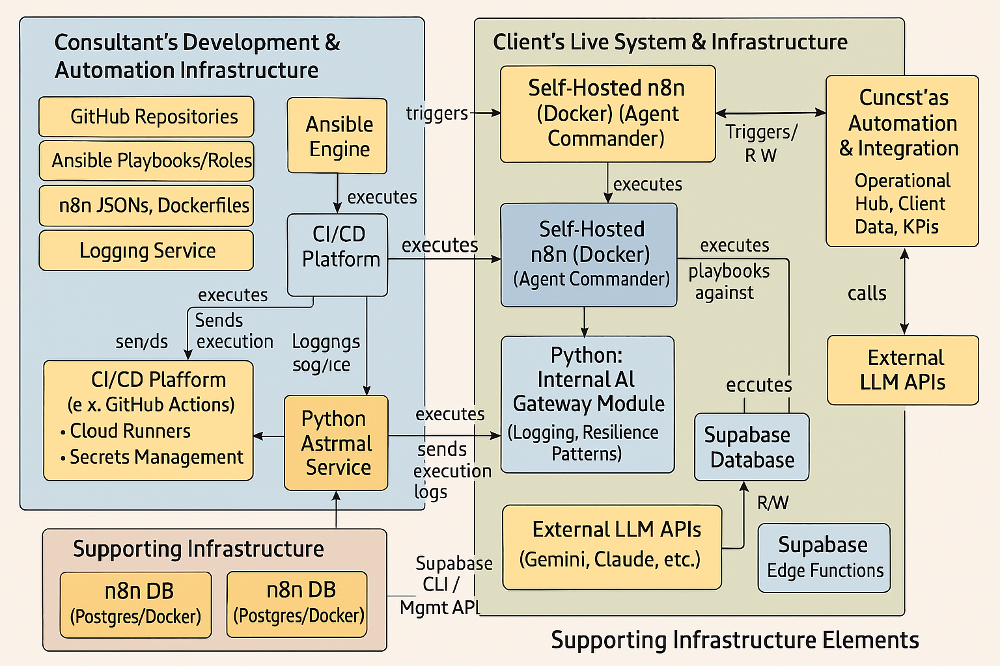

# AI-Enhanced Development & Deployment Factory - Architecture

## 🏗️ **System Architecture Overview**

The AI-Enhanced Development & Deployment Factory represents a strategic evolution from imperative scripting to declarative Infrastructure as Code, integrating advanced MCP capabilities with comprehensive monitoring and safety mechanisms.



## 🎯 **Architectural Principles**

### **1. Infrastructure as Code (IaC)**
- **Declarative Configuration**: YAML-based database and service definitions
- **Version Control**: All infrastructure changes tracked through Git
- **Idempotent Operations**: Consistent, repeatable deployments
- **Environment Parity**: Development, staging, and production alignment

### **2. Model Context Protocol (MCP) Integration**
- **Unified Context**: Seamless access across filesystem, Notion, and Docker services
- **Standardized Interfaces**: Consistent API patterns for all data sources
- **Real-time Synchronization**: Live updates between systems
- **Extensible Architecture**: Plugin-based server addition

### **3. Observability and Safety**
- **Structured Logging**: JSON-formatted, searchable log entries
- **Confidence Gates**: Uncertainty detection and automatic halts
- **Real-time Monitoring**: Web-based dashboard with live metrics
- **Comprehensive Testing**: Automated verification across all components

## 🏛️ **Component Architecture**

### **Core Infrastructure Layer**

#### **MCP Server Infrastructure**
```
┌─────────────────┐    ┌─────────────────┐    ┌─────────────────┐
│  Filesystem     │    │     Notion      │    │     Docker      │
│     Server      │    │     Server      │    │     Server      │
│                 │    │                 │    │                 │
│ • Desktop       │    │ • 7 Databases   │    │ • Containerized │
│ • Downloads     │    │ • CRUD Ops      │    │ • Socat Tunnel  │
│ • Consulting    │    │ • Relations     │    │ • Port 8811     │
└─────────────────┘    └─────────────────┘    └─────────────────┘
```

#### **Notion Database Schema**
```yaml
Master Tasks Database:
  - Properties: 4 (title, status, priority, phase)
  - Relations: 2 (projects, clients)
  - Rollups: 1 (project_count)

Pipeline Projects Database:
  - Properties: 3 (name, status, client)
  - Relations: 1 (client_relation)
  - Rollups: 1 (task_completion)

Clients Database:
  - Properties: 3 (name, status, visibility)
  - Relations: 0
  - Rollups: 1 (active_projects)
```

### **Application Layer**

#### **Claude Framework Architecture**
```
┌─────────────────────────────────────────────────────────────┐
│                    Claude Framework                          │
├─────────────────┬─────────────────┬─────────────────────────┤
│ Confidence Gate │ Enhanced Logger │    MCP Executor         │
│                 │                 │                         │
│ • Uncertainty   │ • JSON Format   │ • Task Management       │
│ • Detection     │ • Operation IDs │ • Retry Logic           │
│ • Safety Halts  │ • Multi-streams │ • Error Handling        │
│ • Validation    │ • Search/Filter │ • File Operations       │
└─────────────────┴─────────────────┴─────────────────────────┘
│                                                             │
├─────────────────┬─────────────────┬─────────────────────────┤
│ Schema Validator│ Real-time       │    Dashboard Server     │
│                 │ Dashboard       │                         │
│ • Flexible      │ • Live Metrics  │ • Web Interface         │
│ • Custom Rules  │ • Log Stream    │ • API Endpoints         │
│ • Error Detail  │ • Statistics    │ • Search/Filter         │
└─────────────────┴─────────────────┴─────────────────────────┘
```

#### **Infrastructure as Code Layer**
```
Ansible Infrastructure:
┌─────────────────────────────────────────────────────────────┐
│                    Notion Database Role                      │
├─────────────────┬─────────────────┬─────────────────────────┤
│ Main Tasks      │ Property        │    Error Handling       │
│                 │ Validation      │                         │
│ • Orchestration │ • Schema Check  │ • API Timeouts          │
│ • Lifecycle Mgmt│ • Type Safety   │ • Rate Limiting         │
│ • Idempotency   │ • Relations     │ • Authentication        │
└─────────────────┴─────────────────┴─────────────────────────┘
│                                                             │
├─────────────────┬─────────────────┬─────────────────────────┤
│ Property        │ Relation        │    Deployment Reports   │
│ Transformation  │ Resolution      │                         │
│ • YAML to API   │ • DB ID Cache   │ • YAML Reports          │
│ • Type Mapping  │ • Dependency    │ • Test Results          │
│ • Config Merge  │ • Resolution    │ • Backup Tracking       │
└─────────────────┴─────────────────┴─────────────────────────┘
```

### **Verification and Testing Layer**

#### **NDB Verification Framework**
```
Verification Test Suites:
┌─────────────────┬─────────────────┬─────────────────────────┐
│ Infrastructure  │ Schema & Data   │    Operations           │
│                 │                 │                         │
│ • NDB-IP1.1     │ • NDB-IP1.2     │ • NDB-IP1.4            │
│ • Ansible       │ • Database      │ • Idempotent           │
│ • Structure     │ • Schema Def    │ • Operations           │
└─────────────────┼─────────────────┼─────────────────────────┤
│ Error Handling  │ Environment     │    Integration          │
│                 │                 │                         │
│ • NDB-IP1.5     │ • NDB-IP1.6     │ • NDB-IP1.7 & 1.8     │
│ • Comprehensive │ • Workspace     │ • Deployment &         │
│ • Coverage      │ • Parameters    │ • Client Portal        │
└─────────────────┴─────────────────┴─────────────────────────┘
```

## 🔄 **Data Flow Architecture**

### **Request Processing Flow**
```
User Request → Confidence Gate → MCP Executor → Notion API
      ↓              ↓               ↓            ↓
   Logging ←── Uncertainty ←── Error ←── Response
   System      Detection     Handling   Processing
      ↓              ↓               ↓            ↓
  Dashboard ←── Statistics ←── Retry ←── Success/
  Updates       Updates      Logic     Failure
```

### **Infrastructure Deployment Flow**
```
YAML Config → Property → Relation → Database → Verification
             Validation  Resolution  Creation   Testing
      ↓           ↓          ↓          ↓         ↓
   Schema ←── Type ←── Dependency ←── API ←── Test
   Check      Safety    Ordering      Call    Results
      ↓           ↓          ↓          ↓         ↓
  Report ←── Error ←── Backup ←── Deploy ←── Success
  Generation  Handling   Creation   Tracking   Confirm
```

## 🛡️ **Security Architecture**

### **Authentication & Authorization**
- **API Key Management**: Environment-based configuration
- **Access Controls**: Role-based permissions per database
- **Client Portal**: Visibility filtering and access restrictions
- **Audit Trail**: Complete operation logging and tracking

### **Data Privacy & Compliance**
- **Sensitive Data**: No credentials stored in version control
- **Client Separation**: Isolated data access per client
- **Backup Security**: Encrypted storage for database snapshots
- **Access Logging**: Complete audit trail for all operations

## ⚡ **Performance Architecture**

### **Optimization Strategies**
- **Request Caching**: Database ID resolution caching
- **Rate Limiting**: API throttling and request management
- **Batch Operations**: Efficient bulk database operations
- **Retry Logic**: Exponential backoff for failed requests

### **Monitoring & Metrics**
- **Real-time Dashboard**: Live system health monitoring
- **Performance Tracking**: Response time and success rate metrics
- **Error Analytics**: Uncertainty detection statistics
- **Resource Usage**: Memory and processing utilization

## 🔮 **Extensibility Architecture**

### **Plugin System**
- **MCP Server Addition**: Standardized server integration
- **Custom Validators**: Extensible schema validation rules
- **Dashboard Widgets**: Modular monitoring components
- **Ansible Roles**: Reusable infrastructure components

### **API Architecture**
- **RESTful Endpoints**: Standard HTTP API for dashboard
- **WebSocket Support**: Real-time updates for monitoring
- **GraphQL Ready**: Structured query support preparation
- **Event System**: Pub/sub for component communication

## 📊 **Scalability Considerations**

### **Horizontal Scaling**
- **Multi-workspace**: Independent environment support
- **Client Isolation**: Separated database instances
- **Load Distribution**: Ansible role parallelization
- **Resource Optimization**: Efficient memory and CPU usage

### **Vertical Scaling**
- **Performance Tuning**: Configurable timeouts and retries
- **Memory Management**: Efficient data structure usage
- **Process Optimization**: Async operation handling
- **Resource Monitoring**: Usage tracking and alerting

---

**Architecture Version**: 1.0.0  
**Last Updated**: June 7, 2025  
**Status**: ✅ Production Ready